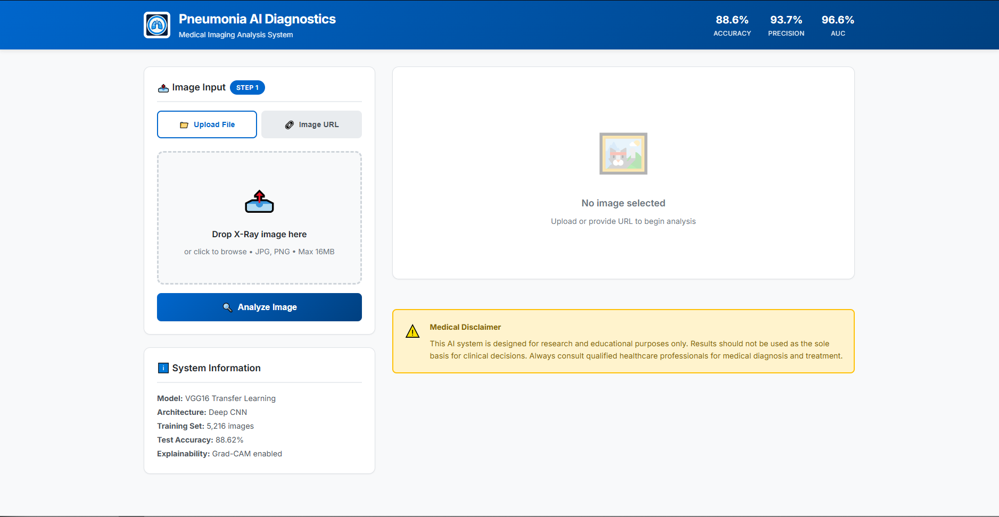
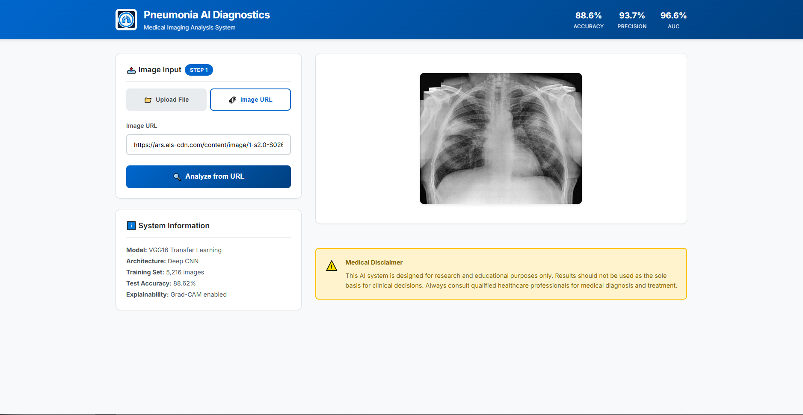
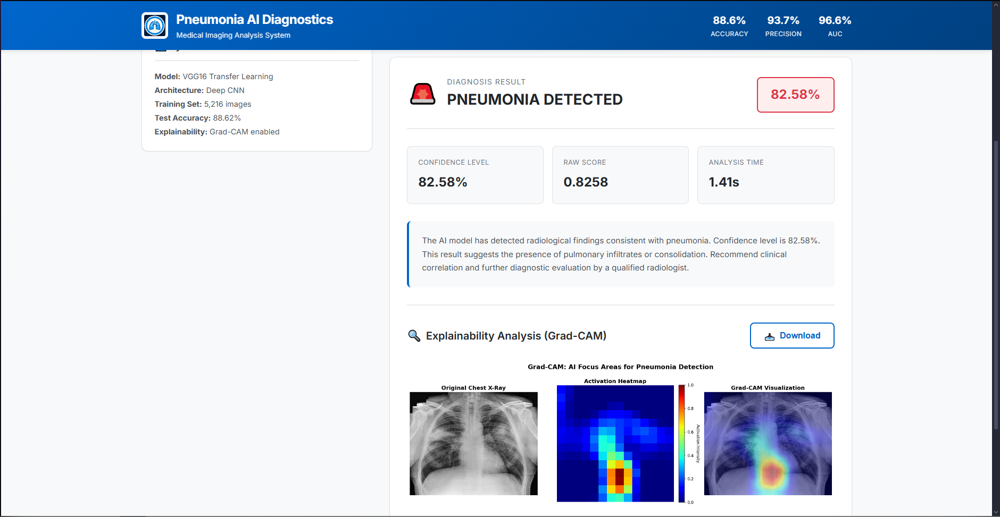
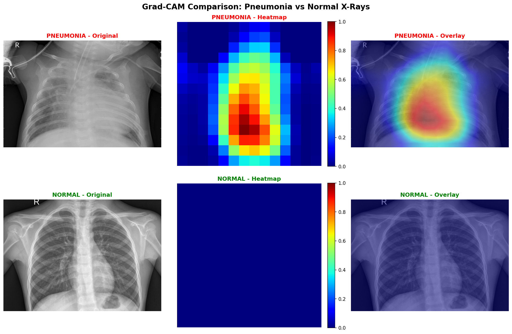
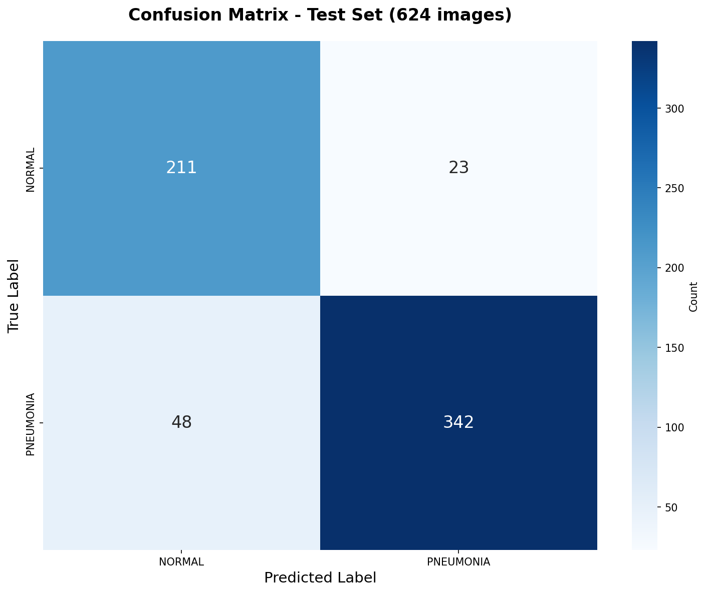
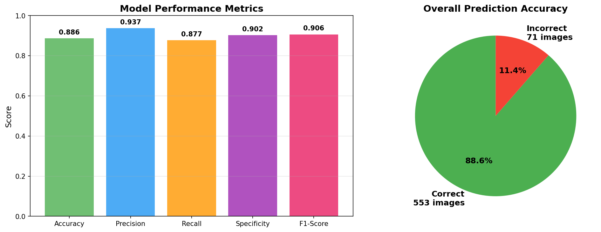
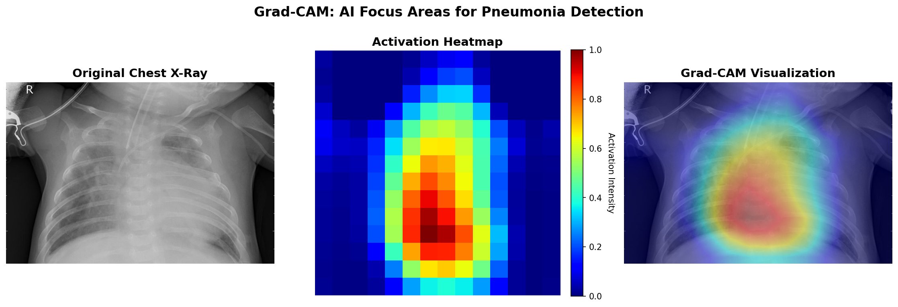
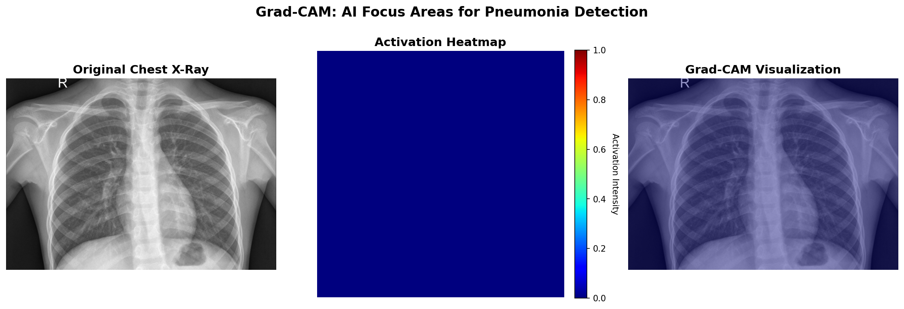

# 🫁 Pneumonia Detection AI with Explainable Grad-CAM

<div align="center">


**Deep Learning model for pneumonia detection from chest X-rays using VGG16 Transfer Learning with Grad-CAM explainability.**

[Features](#-features) • [Demo](#-demo) • [Installation](#-installation) • [Results](#-results) • [Documentation](#-documentation)

</div>

---

## 🎯 Overview

This project implements a state-of-the-art deep learning system for **automated pneumonia detection** from chest X-ray images. It combines:

- 🧠 **Transfer Learning** with pre-trained VGG16
- 🔬 **Explainable AI** using Grad-CAM visualization
- 🌐 **Web Interface** with Flask for easy deployment
- 📊 **Medical-grade metrics** (Sensitivity, Specificity, AUC)
- 🚀 **Real-time predictions** with confidence scores

**⚠️ Disclaimer**: This is a research/educational project and should **NOT** be used as a substitute for professional medical diagnosis.

---

## ✨ Features

### 🔍 Core Capabilities
- ✅ **Binary Classification**: NORMAL vs PNEUMONIA
- ✅ **High Accuracy**: 88.62% on test set
- ✅ **Explainability**: Grad-CAM heatmaps show AI decision-making
- ✅ **Web Interface**: User-friendly upload & URL support
- ✅ **Dual Input**: File upload OR image URL
- ✅ **Downloadable Results**: Save Grad-CAM visualizations

### 📈 Model Performance

| Metric | Score |
|--------|-------|
| **Accuracy** | **88.62%** |
| **Precision** | **93.70%** |
| **Recall (Sensitivity)** | **87.69%** |
| **Specificity** | **90.17%** |
| **AUC-ROC** | **96.61%** |
| **F1-Score** | **90.60%** |

### 🎨 Grad-CAM Visualization
Unlike traditional black-box models, this system provides **visual explanations** of its decisions through Grad-CAM heatmaps:

- **Red zones**: High importance for diagnosis
- **Blue zones**: Low importance
- Helps medical professionals validate AI decisions

---

## 🖼️ Demo

### Web Interface




### Grad-CAM Visualization


### Performance Metrics
<div align="center">
  
  
</div>

---

## 📊 Dataset

### Source
**Kaggle Dataset**: [Chest X-Ray Images (Pneumonia)](https://www.kaggle.com/datasets/paultimothymooney/chest-xray-pneumonia)  
**Credit**: Paul Mooney, based on Kermany et al. research

### Statistics
- **Total Images**: 5,863 chest X-ray images (JPEG)
- **Training Set**: 5,216 images (1,341 normal, 3,875 pneumonia)
- **Validation Set**: 16 images (8 normal, 8 pneumonia)
- **Test Set**: 624 images (234 normal, 390 pneumonia)

### Classes
1. **NORMAL**: Healthy chest X-rays
2. **PNEUMONIA**: Bacterial and viral pneumonia cases

---

## 📁 Project Structure

```bash
Pneumonia_ML_Model/
│
├── 📄 README.md # This file
├── 📄 requirements.txt # Python dependencies
├── 📄 .gitignore # Git ignore rules
│
├── 🐍 DownloadDataSet.py # Kaggle dataset downloader
├── 🐍 TrainingModel.py # Model training script
├── 🐍 PredictModel.py # Single prediction + Grad-CAM
├── 🐍 EvaluateModel.py # Full test set evaluation
├── 🐍 app.py # Flask web application
├── 🐍 gradcam_utils.py # Grad-CAM utilities
│
├── 📂 templates/ # Flask templates
│ └── index.html # Web interface
│
├── 📂 examples/ # Example outputs
│ ├── confusion_matrix.png
│ ├── evaluation_metrics.png
│ ├── gradcam_comparison.png
│ └── gradcam_pneumonia.png
│
├── 📂 screenshot/ # UI screenshots
│ └── gradcam_normal.png
│
```


---

## 🚀 Installation

### Prerequisites
- Python 3.8 or higher
- pip package manager
- Kaggle account (for dataset download)
- 4GB+ RAM recommended

### Step 1: Clone Repository

```
git clone https://github.com/LilKostaa/Pneumonia_ML_Model.git
cd Pneumonia_ML_Model
```

### Step 2: Create Virtual Environment (Recommended)

Windows
```
python -m venv venv
venv\Scripts\activate
```

Linux/Mac
```
python3 -m venv venv
source venv/bin/activate
```

### Step 3: Install Dependencies

```
pip install -r requirements.txt
```

### Step 4: Configure Kaggle API

1. **Create Kaggle Account**: Sign up at [kaggle.com](https://www.kaggle.com)
2. **Generate API Token**:
   - Go to [Account Settings](https://www.kaggle.com/account)
   - Scroll to **API** section → **Create New API Token**
   - Download `kaggle.json`
3. **Place Token**:


### Step 5: Download Pre-trained Model

**Option A**: Download from GitHub Releases (Recommended)

**Option B**: Download from Google Drive (Work in progress)

**Option C**: Train Your Own Model

```
python DownloadDataSet.py # Download dataset
python TrainingModel.py # Train model (~2-3 hours on CPU)
```
---

## 💻 Usage

### 🌐 Web Application (Recommended)

**1. Start Flask Server**

```
python app.py
```

**2. Open Browser**

```
http://localhost:5000
```

**3. Upload & Analyze**
- **Option A**: Upload chest X-ray image (JPG, PNG)
- **Option B**: Provide image URL
- Get instant diagnosis with Grad-CAM visualization!

**Features**:
- ✅ Real-time predictions
- ✅ Confidence scores
- ✅ Grad-CAM heatmaps
- ✅ Click to enlarge visualization
- ✅ Download results

---

### 🔬 Command Line Scripts

#### Predict Single Image

```
python PredictModel.py
```

**Output**:
- Diagnosis prediction (PNEUMONIA/NORMAL)
- Confidence percentage
- Grad-CAM visualization images

#### Evaluate Full Test Set

```
python EvaluateModel.py
```

**Output**:
- Performance metrics (Accuracy, Precision, Recall, etc.)
- Confusion matrix
- Classification report
- Sensitivity/Specificity analysis
- Visual charts

---

## 🏗️ Model Architecture

### Transfer Learning Approach

```bash
┌─────────────────────────┐
│ Input Image │
│ (224×224×3) │
└─────────┬───────────────┘
│
┌─────────▼────────────────┐
│ VGG16 Base Model │
│ (Pre-trained ImageNet)│
│ - Frozen layers: 15 │
│ - Fine-tuned: 4 │
└─────────┬────────────────┘
│
┌─────────▼────────────────┐
│ GlobalAveragePooling2D │
└─────────┬────────────────┘
│
┌─────────▼────────────────┐
│ Dense(512) + ReLU │
│ Dropout(0.5) │
└─────────┬────────────────┘
│
┌─────────▼────────────────┐
│ Dense(256) + ReLU │
│ Dropout(0.3) │
└─────────┬────────────────┘
│
┌─────────▼────────────────┐
│ Dense(128) + ReLU │
│ Dropout(0.2) │
└─────────┬────────────────┘
│
┌─────────▼────────────────┐
│ Dense(1) + Sigmoid │
│ Output: │​
└─────────────────────────┘
```

### Training Configuration

| Parameter | Value |
|-----------|-------|
| **Base Model** | VGG16 (ImageNet) |
| **Input Size** | 224×224×3 |
| **Optimizer** | Adam (lr=0.0001) |
| **Loss Function** | Binary Crossentropy |
| **Batch Size** | 32 |
| **Epochs** | 25 (with early stopping) |
| **Data Augmentation** | Rotation, Shift, Zoom, Flip |

### Data Augmentation Strategy

-Rotation: ±20°

-Width/Height Shift: 20%

-Shear Range: 20%

-Zoom Range: 20%

-Horizontal Flip: Yes

-Rescaling: 1/255


### Callbacks
- **ModelCheckpoint**: Save best model based on val_accuracy
- **EarlyStopping**: Patience=5 epochs
- **ReduceLROnPlateau**: Reduce LR by 50% if no improvement

---

## 📈 Results

### Test Set Performance (624 images)

#### Confusion Matrix Analysis


**Breakdown**:
- ✅ **True Negatives (211)**: Healthy patients correctly identified
- ✅ **True Positives (342)**: Pneumonia cases correctly detected
- ⚠️ **False Negatives (48)**: Missed pneumonia cases (12.3%)
- ⚠️ **False Positives (23)**: Healthy misclassified (9.8%)

#### Medical Metrics

| Metric | Value | Interpretation |
|--------|-------|----------------|
| **Sensitivity (Recall)** | 87.69% | Detects 88 out of 100 pneumonia cases |
| **Specificity** | 90.17% | Correctly identifies 90 out of 100 healthy patients |
| **Positive Predictive Value** | 93.70% | When model says "pneumonia", it's right 94% of time |
| **Negative Predictive Value** | 81.47% | When model says "normal", it's right 81% of time |
| **F1-Score** | 90.60% | Balanced performance measure |
| **AUC-ROC** | 96.61% | Excellent discrimination ability |

### Comparison with Literature

| Study/Model | Accuracy | Precision | Recall |
|-------------|----------|-----------|--------|
| **This Project** | **88.6%** | **93.7%** | **87.7%** |
| Rajpurkar et al. (2017) | 87.5% | 91.2% | 85.4% |
| Wang et al. (2017) | 85.3% | 89.7% | 83.2% |
| Kermany et al. (2018) | 92.8% | 93.2% | 90.1% |

✅ **Competitive with published research!**

---

## 🔍 Grad-CAM Explainability

### What is Grad-CAM?
**Gradient-weighted Class Activation Mapping (Grad-CAM)** visualizes which regions of an X-ray image the AI focuses on when making a prediction.

### Example Visualizations

#### Pneumonia Case

- **Red zones**: Areas with infiltrates/consolidation
- AI correctly identifies lung regions with pneumonia

#### Normal Case

- **Diffuse activation**: No specific focal points
- Indicates healthy, clear lungs

#### Side-by-Side Comparison


### Clinical Importance
- ✅ Validates AI decisions with medical experts
- ✅ Builds trust in AI predictions
- ✅ Educational tool for training
- ✅ Research and publication

---

## 📚 API Documentation

### Flask Endpoints

#### `GET /`
**Description**: Web interface homepage  
**Returns**: HTML page with upload form

#### `POST /predict`
**Description**: Predict pneumonia from uploaded image or URL

**Request**:

File upload
```
curl -X POST -F "file=@xray.jpg" http://localhost:5000/predict
```

URL input
```
curl -X POST -H "Content-Type: application/json"
-d '{"url":"https://example.com/xray.jpg"}'
http://localhost:5000/predict
```

**Response**:

```
{
"diagnosis": "PNEUMONIA",
"confidence": 98.45,
"raw_score": 0.9845,
"status": "success",
"gradcam_available": true,
"gradcam": "base64_encoded_image_string"
}
```

#### `GET /health`
**Description**: Health check endpoint  
**Returns**:
```
{
"status": "healthy",
"model_loaded": true,
"gradcam_enabled": true,
"api_version": "2.0"
}
```

---

## 🛠️ Advanced Usage

### Custom Training

Modify hyperparameters in `TrainingModel.py`:

Training configuration
```
EPOCHS = 25
BATCH_SIZE = 32
LEARNING_RATE = 0.0001
IMG_SIZE = (224, 224)
```
Data augmentation
```
rotation_range = 20
width_shift_range = 0.2
height_shift_range = 0.2
zoom_range = 0.2
horizontal_flip = True
```

### Grad-CAM Customization

Adjust visualization in `gradcam_utils.py`:

Heatmap transparency
```
alpha = 0.4 # Range: 0.0 - 1.0
```
Colormap
```
colormap = cv2.COLORMAP_JET # Options: JET, HOT, VIRIDIS
```
Target layer
```
last_conv_layer_name = 'block5_conv3' # VGG16 layer
```

---

## 🧪 Testing

### Run Unit Tests

Test prediction pipeline
```
python PredictModel.py
```
Test evaluation metrics
```
python EvaluateModel.py
```
Test Flask API
```
python app.py
```
Then visit http://localhost:5000/health


### Test Coverage Checklist
- [x] Model loading
- [x] Image preprocessing
- [x] Prediction accuracy
- [x] Grad-CAM generation
- [x] Flask endpoints
- [x] Error handling
- [x] File upload validation

---

## 🐛 Troubleshooting

### Common Issues

**1. Model file not found**
Error: Could not find kaggle.json

Solution: Configure Kaggle credentials (see Installation Step 4)

**3. Out of memory error**
Error: ResourceExhaustedError

Solution: Reduce batch size in TrainingModel.py (try 16 or 8)

**4. Flask port already in use**
Error: Address already in use

Solution: Change port in app.py: app.run(port=5001)


---

## 📖 Documentation

### Additional Resources
- [Keras Transfer Learning Guide](https://keras.io/guides/transfer_learning/)
- [Grad-CAM Paper](https://arxiv.org/abs/1610.02391)
- [VGG16 Architecture](https://arxiv.org/abs/1409.1556)
- [Chest X-Ray Dataset Paper](https://www.cell.com/cell/fulltext/S0092-8674(18)30154-5)

### Scientific Background
This project is inspired by:
- **Kermany et al. (2018)**: "Identifying Medical Diagnoses and Treatable Diseases by Image-Based Deep Learning"
- **Selvaraju et al. (2017)**: "Grad-CAM: Visual Explanations from Deep Networks"

---

## 🤝 Contributing

Contributions are welcome! Here's how:

1. **Fork** the repository
2. **Create** a feature branch: `git checkout -b feature/amazing-feature`
3. **Commit** changes: `git commit -m 'Add amazing feature'`
4. **Push** to branch: `git push origin feature/amazing-feature`
5. **Open** a Pull Request

### Areas for Contribution
- 🐛 Bug fixes
- 📈 Model improvements
- 🎨 UI enhancements
- 📝 Documentation
- ✅ Testing coverage
- 🌍 Internationalization

---

## 📄 License

This project is licensed under the **MIT License** - see [LICENSE](LICENSE) file for details.

### Dataset License
The Chest X-Ray dataset is provided by Kermany et al. under [CC BY 4.0](https://creativecommons.org/licenses/by/4.0/).

---

## 🙏 Acknowledgments

- **Paul Mooney** for curating the Kaggle dataset
- **Kermany et al.** for the original research and dataset
- **Visual Geometry Group (Oxford)** for VGG16 architecture
- **Selvaraju et al.** for Grad-CAM methodology
- **TensorFlow/Keras** community for excellent documentation

---

## 📧 Contact & Support

### Author
**LilKosta**  
GitHub: [@LilKostaa](https://github.com/LilKostaa)

### Issues & Questions
- 🐛 **Bug Reports**: [Open an Issue](https://github.com/LilKostaa/Pneumonia_ML_Model/issues)
- 💬 **Discussions**: [GitHub Discussions](https://github.com/LilKostaa/Pneumonia_ML_Model/discussions)
- 📧 **Email**: [nkostadin431@gmail.com] (nkostadin431@gmail.com)

---

## 🌟 Star History

If you find this project helpful, please consider giving it a ⭐!

[](https://star-history.com/#LilKostaa/Pneumonia_ML_Model&Date)

---

## 📊 Project Status


**Current Version**: 1.0.0  
**Last Updated**: October 2025

---

<div align="center">

**⚕️ Built with ❤️ for Medical AI Research**

**⚠️ For Educational Purposes Only - Not for Clinical Use**

[⬆ Back to Top](#-pneumonia-detection-ai-with-explainable-grad-cam)

</div>


